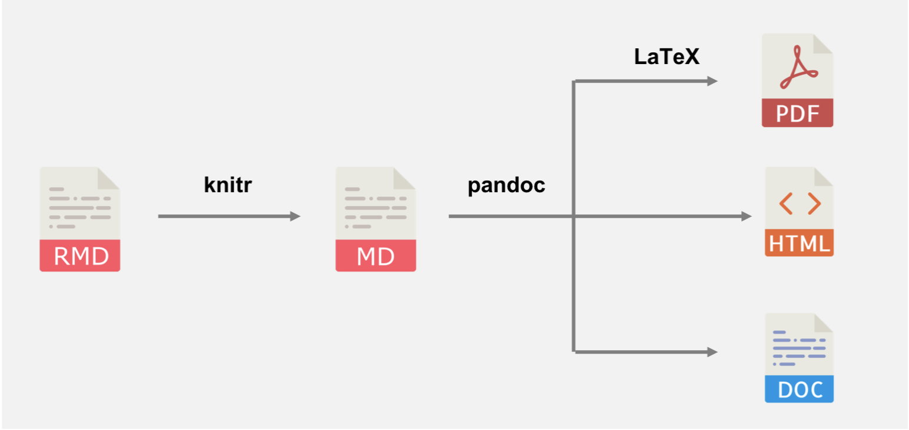
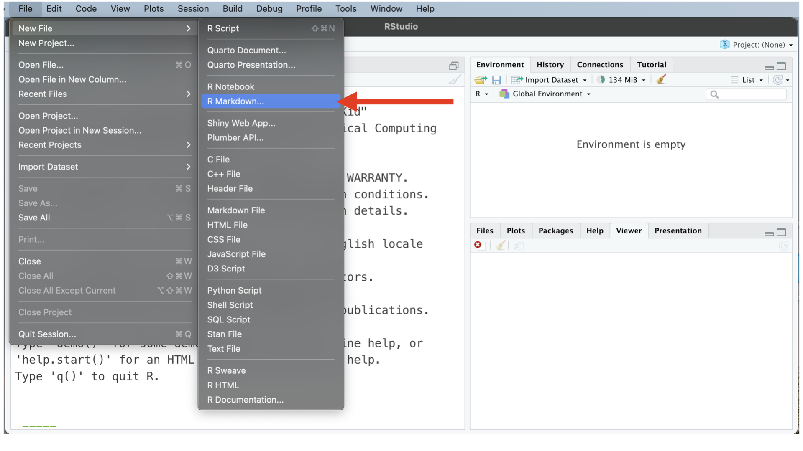
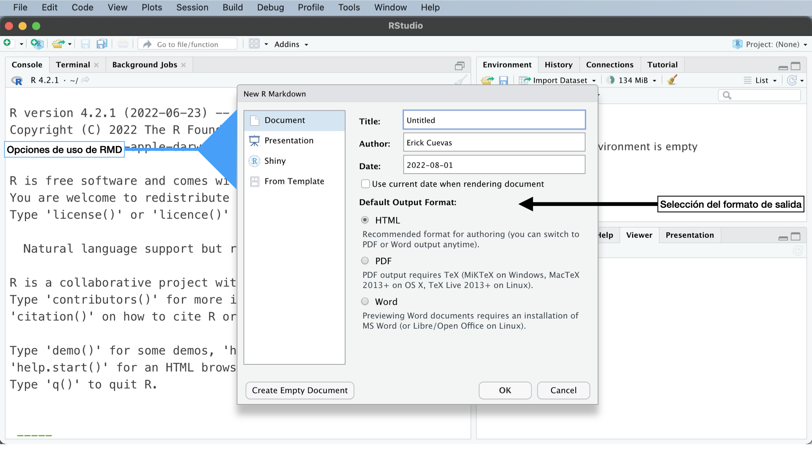

```{r xaringanExtra-clipboard, echo=FALSE}
# No quitar! Es para que aparezca la opción copy code en los R chunks
xaringanExtra::use_clipboard()
```

class: inverse

.pull-right[<br>
```{r, echo=FALSE, out.width='80%', fig.align='center'}
knitr::include_graphics("css/xolo.png")
```
]

# Contenido:

1. ¿Qué es y para que sirve RMarkdown?
2. Primeros pasos: Crear un archivo `.Rmd`
3. Sintaxis Markdown:
  
  3.1 Elementos de bloque:
    - Encabezados
    - Listas
    - Citas
    - Párrafos 
---
class: inverse

.pull-right[<br>
```{r, echo=FALSE, out.width='80%', fig.align='center'}
knitr::include_graphics("css/xolo.png")
```
]

# Contenido:

3.2 Elementos de línea:
  - Énfasis 
  - Expresiones matemáticas 
  - Enlaces
  - Código
  - Comentar texto
  - Imagen 
---

class: center

# Agradecimientos

Este contenido se basó en:

- [Advanced R Markdown Workshop rstudio::conf 2019](https://arm.rbind.io)
- [R Markdown Cookbook](https://bookdown.org/yihui/rmarkdown-cookbook/)

---

# Preparar nuestra sesión de R

```{r echo=TRUE, eval=FALSE}
# Instalar desde el repositorio de CRAN
install.packages("rmarkdown")

# O también puedes instalar la versión en desarrollo
if (!requireNamespace("devtools"))
  install.packages('devtools')
devtools::install_github('rstudio/rmarkdown')

# Instalar la paquetería para poder compilar en LaTeX
install.packages('tinytex')
tinytex::install_tinytex()  # install TinyTeX
```

Con RStudio en automático tenemos [**pandoc**](http://pandoc.org/) y [**knitr**](https://yihui.org/knitr/)

---
class: inverse

# 1. ¿Qué es y para que sirve RMarkdown?

**Rmarkdown** se basa en el lenguaje *markdown* que sirve para convertir texto plano a formato HTML. Este tipo de archivo de archivo esta disponible en RStudio, y esto nos permite integrar código con texto. 

Puedes obtener los siguientes archivos de salida:

- PDF
- HTML
- Microsoft Word


---

```{r, echo=FALSE, out.width='80%', fig.align='center'}

```

`.Rmd` es nuestro archivo editable y consta de metadata, texto y bloques de código. `Knit` convierte el `.Rmd` en `.md` (*Tejer*). `Pandoc` hace la introversión entre los distintos tipos de archivos de salida. 

---

class: chapter-slide

# Algunos usos

---

##Agregar en un informe la información de una localización

```{r out.width='100%', fig.height=6, eval=require('leaflet')}
library(leaflet)
leaflet() %>% addTiles() %>% setView(lat = 18.95, lng = -99.239, zoom = 13)
```


---
class: center

## Poner la chicharronera (Fórmula cuadrática en un texto)

Esto es la chicharronera dentro de un texto $$x = \frac {-b \pm \sqrt {b^2 - 4ac}}{2a}$$

Y puedo seguir describiendo lo que siga haciendo.

$$\text{La Fórmula Cuadrática es }x = \frac {-b \pm \sqrt {b^2 - 4ac}}{2a}$$
---
.center[
# Ejemplos de uso y páginas útiles
]

- [RPubs](https://rpubs.com)
- [Generar correos personalizados](https://rmarkdown.rstudio.com/articles_mail_merge.html)
- [Escribir artículos](https://elifesciences.org/labs/cad57bcf/composing-reproducible-manuscripts-using-r-markdown)
  - [rticles](https://github.com/rstudio/rticles)
- [Escribir Libros](https://bookdown.org/)
  - [Escribir tesis](https://eddjberry.netlify.com/post/writing-your-thesis-with-bookdown/)
- [Crear sitios web](https://github.com/seankross/postcards)


---
.center[
# Crear un archivo `.Rmd`
]

## Paso 1

```{r, echo=FALSE, out.width='80%', fig.align='center'}

```
---

## Paso 2

```{r, echo=FALSE, out.width='80%', fig.align='center'}

```
---
# Listo, tenemos un archivo listo `Rmd`

---
.pull-left[<br><br><br><br><br><br><br>
.center[
# ¡Gracias! 
]
]

.pull-right[<br>
```{r, echo=FALSE, out.width='80%', fig.align='center'}
knitr::include_graphics("css/xolo.png")
```

]
