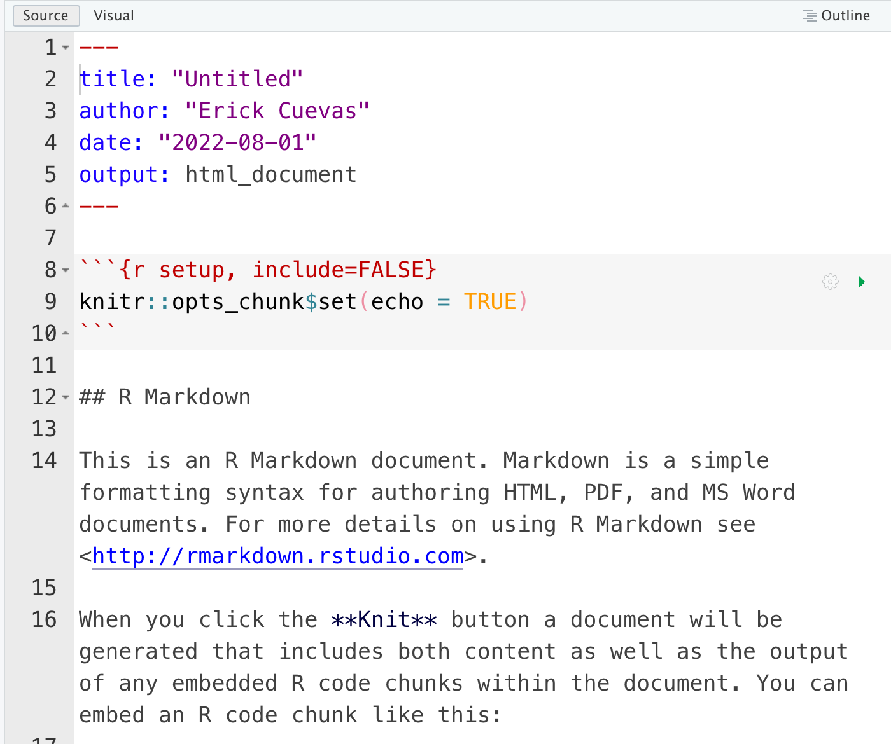
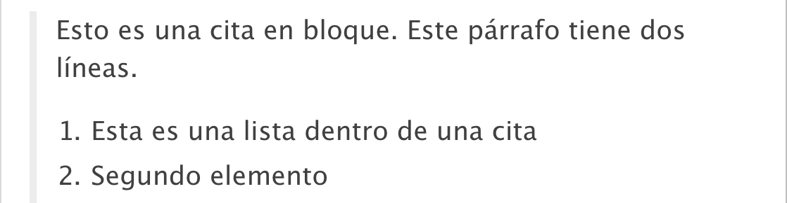
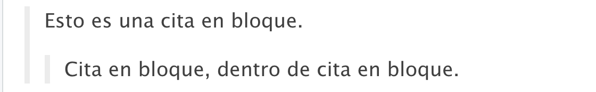
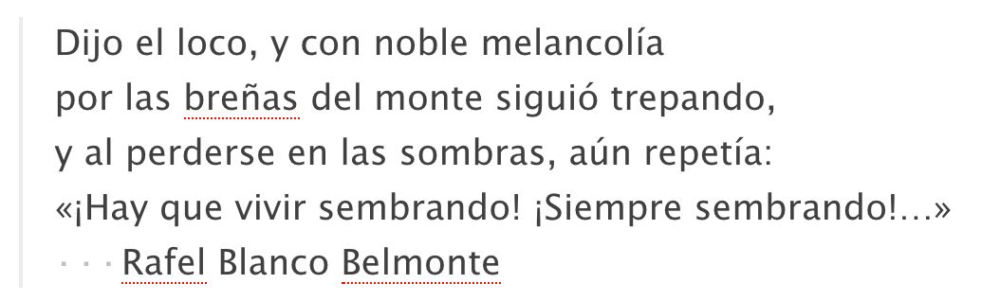
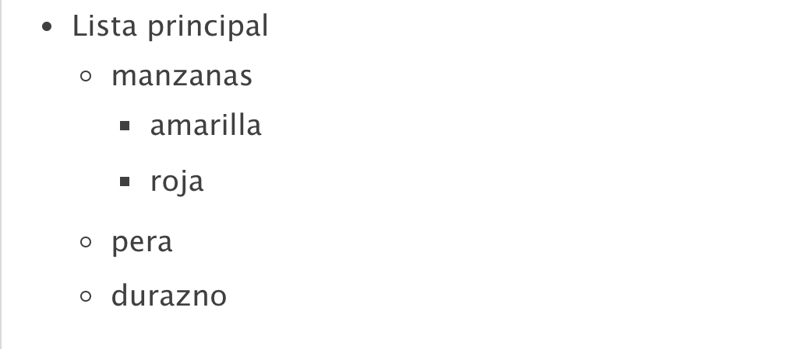
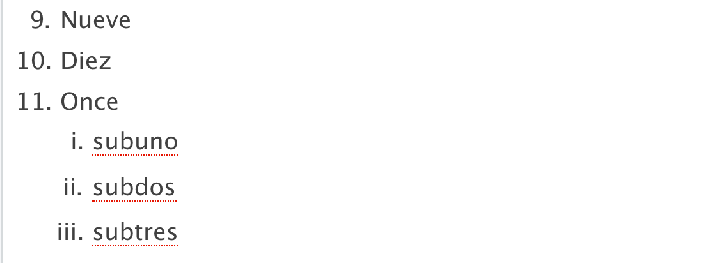
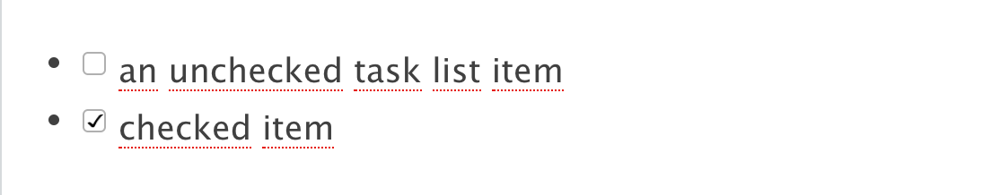
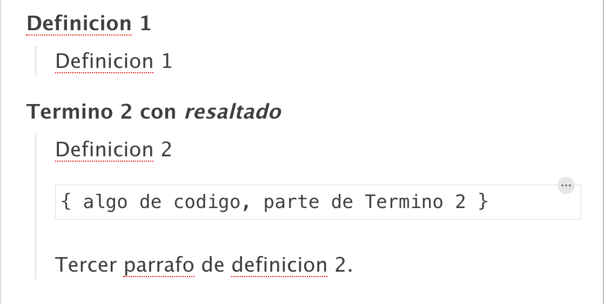
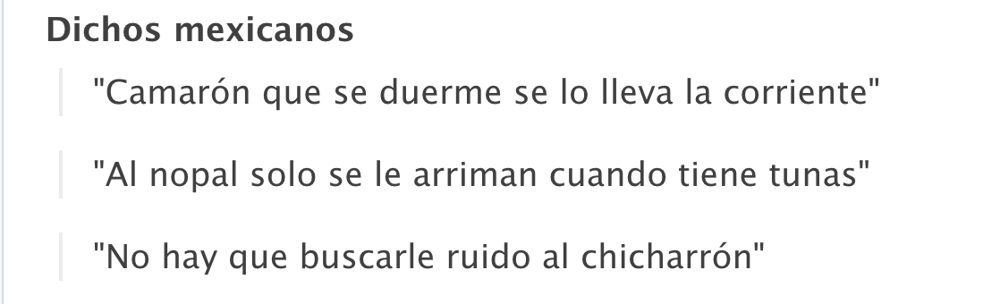

```{r xaringanExtra-clipboard, echo=FALSE}
# No quitar! Es para que aparezca la opción copy code en los R chunks
xaringanExtra::use_clipboard()
```

class: inverse

.pull-right[<br>
```{r, echo=FALSE, out.width='80%', fig.align='center'}
knitr::include_graphics("css/xolo.png")
```
]

# Contenido:

1. ¿Qué es y para que sirve RMarkdown?
2. Primeros pasos: Crear un archivo `.Rmd`
3. Sintaxis Markdown:
  
  3.1 Elementos de bloque:
    - Encabezados
    - Listas
    - Citas
    - Párrafos 
---
class: inverse

.pull-right[<br>
```{r, echo=FALSE, out.width='80%', fig.align='center'}
knitr::include_graphics("css/xolo.png")
```
]

# Contenido:

3.2 Elementos de línea:
  - Énfasis 
  - Expresiones matemáticas 
  - Enlaces
  - Código
  - Comentar texto
  - Imagen 
---

class: center

# Agradecimientos

Este contenido se basó en:

- [Advanced R Markdown Workshop rstudio::conf 2019](https://arm.rbind.io)
- [R Markdown Cookbook](https://bookdown.org/yihui/rmarkdown-cookbook/)

---

# Preparar nuestra sesión de R

```{r echo=TRUE, eval=FALSE}
# Instalar desde el repositorio de CRAN
install.packages("rmarkdown")

# O también puedes instalar la versión en desarrollo
if (!requireNamespace("devtools"))
  install.packages('devtools')
devtools::install_github('rstudio/rmarkdown')

# Instalar la paquetería para poder compilar en LaTeX
install.packages('tinytex')
tinytex::install_tinytex()  # install TinyTeX
```

Con RStudio en automático tenemos [**pandoc**](http://pandoc.org/) y [**knitr**](https://yihui.org/knitr/)

---
class: inverse

# 1. ¿Qué es y para que sirve RMarkdown?

**Rmarkdown** se basa en el lenguaje *markdown* que sirve para convertir texto plano a formato HTML. Este tipo de archivo de archivo esta disponible en RStudio, y esto nos permite integrar código con texto. 

Puedes obtener los siguientes archivos de salida:

- PDF
- HTML
- Microsoft Word


---

```{r, echo=FALSE, out.width='80%', fig.align='center'}
knitr::include_graphics("img/how_work.png")
```

`.Rmd` es nuestro archivo editable y consta de metadata, texto y bloques de código. `Knit` convierte el `.Rmd` en `.md` (*Tejer*). `Pandoc` hace la introversión entre los distintos tipos de archivos de salida. 

---

class: chapter-slide

# Algunos usos

---

##Agregar en un informe la información de una localización

```{r out.width='100%', fig.height=6, eval=require('leaflet')}
library(leaflet)
leaflet() %>% addTiles() %>% setView(lat = 18.95, lng = -99.239, zoom = 13)
```


---
class: center

## Poner la chicharronera (Fórmula cuadrática en un texto)

Esto es la chicharronera dentro de un texto $$x = \frac {-b \pm \sqrt {b^2 - 4ac}}{2a}$$

Y puedo seguir describiendo lo que siga haciendo.

$$\text{La Fórmula Cuadrática es }x = \frac {-b \pm \sqrt {b^2 - 4ac}}{2a}$$
---
.center[
# Ejemplos de uso y páginas útiles
]

- [RPubs](https://rpubs.com)
- [Generar correos personalizados](https://rmarkdown.rstudio.com/articles_mail_merge.html)
- [Escribir artículos](https://elifesciences.org/labs/cad57bcf/composing-reproducible-manuscripts-using-r-markdown)
  - [rticles](https://github.com/rstudio/rticles)
- [Escribir Libros](https://bookdown.org/)
  - [Escribir tesis](https://eddjberry.netlify.com/post/writing-your-thesis-with-bookdown/)
- [Crear sitios web](https://github.com/seankross/postcards)


---
.center[
# Crear un archivo `Rmd`
]

## Paso 1

```{r, echo=FALSE, out.width='80%', fig.align='center'}
knitr::include_graphics("img/abrir_rmd.png")
```
---

## Paso 2

```{r, echo=FALSE, out.width='80%', fig.align='center'}
knitr::include_graphics("img/rmd_op.png")
```
---
# Listo, tenemos un archivo listo `Rmd`

```{r, echo=FALSE, out.width='60%', fig.align='center'}

```

---
# Estructura básica del RMarkdown

**YAML**
```yaml
---
title: "Bienvenido CDSB 2022"
author: "EMB 2022"
date: "2022-08-01"
output: html_document
---
```

Aquí podemos configurar nuestro archivo markdown. Básicamente aqui suceden todos los cambios en el formato, para hacer paginas web, diapositivas o informes.


---
# Estructura básica del RMarkdown

**Markdown**
````markdown
Parrafo de R Markdown.

Esto es un fragmento de código o "chunk":

```{r}
fit = lm(dist ~ speed, data = cars)
b   = coef(fit)

```

La pendiente de la regresión es `r b[1]`.
````
---

# Sintaxis básica. Encabezados.

Encabezados de estilo Setext

.pull-left[
````markdown

Título de nivel 1
===================

Título de nivel 2
-------------------

````
]

.pull-right[
Título de nivel 1
===================

Título de nivel 2
-------------------
]

---

# Sintaxis básica. Encabezados.

Encabezados de estilo ATX. Un encabezamiento de estilo ATX consta de uno a seis signos # y una línea de texto

.pull-left[
````markdown
# Título de nivel 1

## Título de nivel 2

### Título de nivel 3

#### Título de nivel 4
````
]

.pull-right[
# Título de nivel 1

## Título de nivel 2

### Título de nivel 3
]
---
# Sintaxis básica. Citas en bloque.

.pull-left[
````markdown
> Esto es una cita en bloque. Este
> párrafo tiene dos líneas.
>
> 1. Esta es una lista dentro de una cita
> 2. Segundo elemento
````
]

.pull-right[
```{r, echo=FALSE, out.width='100%', fig.align='center'}

```
]

---
# Sintaxis básica. Citas en bloque.

.pull-left[
````markdown
> Esto es una cita en bloque.
>
> > Cita en bloque, dentro de cita en bloque.
````
]

.pull-right[
```{r, echo=FALSE, out.width='100%', fig.align='center'}

```
]

---
# Sintaxis básica. Texto en bloque.

Útil para cuando queremo ocupar sangrias especificas en el texto. 

.pull-left[
````markdown
| Dijo el loco, y con noble melancolía
| por las breñas del monte siguió trepando,
| y al perderse en las sombras, aún repetía:
| «¡Hay que vivir sembrando! ¡Siempre sembrando!...»
|    Rafel Blanco Belmonte
````
]

.pull-right[
```{r, echo=FALSE, out.width='100%', fig.align='center'}

```

]
---
# Sintaxis básica. Listas.

Para las listas puedes utilizar los siguientes símbolos: `*`, `+`, `-`, números y letras. ¿Qué le falta a la lista (lado izquierdo)? 

.pull-left[

```{r eval=FALSE}
* Lista principal
  + manzanas
    - amarilla
    - roja
  + pera
  + durazno
```

]

.pull-right[
```{r, echo=FALSE, out.width='100%', fig.align='center'}

```
]

---
# Sintaxis básica. Listas.

**NOTA**: si quieres que se enumeren automaticamente usa `*.` en tus listas. Vamos a probarlo.

.pull-left[

```{r eval=FALSE}
9)  Nueve
10) Diez
11) Once
    i.  subuno
    ii. subdos
    iii. subtres
```
]

.pull-right[
```{r, echo=FALSE, out.width='100%', fig.align='center'}

```
    
]

---
# Sintaxis básica. Listas.

.pull-left[

```{r eval=FALSE}
- [ ] an unchecked task list item
- [x] checked item 

```

```{r eval=FALSE}
Definicion 1

:   Definicion 1

Termino 2 con *resaltado*

:   Definicion 2

        { algo de codigo, parte de Termino 2 }

    Tercer parrafo de definicion 2.

```
]

.pull-right[

```{r, echo=FALSE, out.width='100%', fig.align='center'}

```

```{r, echo=FALSE, out.width='100%', fig.align='center'}

```
  
]
---

# Actividad

1. Abre un `.rmd`.
2. Intenta hacer una lista con dichos mexicanos famosos. 
3. Compartenos tu resultado en HTML. 

## Ejemplo

```{r, echo=FALSE, out.width='70%', fig.align='center'}

```


---

# Sintaxis básica. Bloques de código.

Puedes poner código entre tu texto con el símbolo del "acento al revés" en los extremos de tu código. 

RMarkdown tiene la disponibilidad de "chunks", tiene la disponibilidad de lenguajes como: Python, SQL, Bash, Rcpp, Stan, JavaScript y CSS.

Aquí puedes consultar la guia de referencia de RMarkdown: [https://www.rstudio.com/wp-content/uploads/2015/03/rmarkdown-reference.pdf](https://www.rstudio.com/wp-content/uploads/2015/03/rmarkdown-reference.pdf)


Vamos a RStudio a ver como hacerlo. Y vamos a aprender empezar con templates. 


---
# Elementos de línea. 

- `*Cursiva*` genera *Cursiva*
- `**Resaltada**` genera **Resaltada**
- `***Resaltada Cursiva***` genera ***Resaltada Cursiva***
- `[Nombre_Link](URL)` genera [Nombre_Link](https://github.com/ComunidadBioInfo)
- `$z = \frac{1}{x} + 4$` genera $z = \frac{1}{x} + 4$

¿Cómo hago comentario dentro de RMarkdown y cómo agrego una imagen?

---

# Actividad

- Por equipos de repositorio. Generen en GitHub un repositorio en conjunto. Enlacen RStudio con GitHub.
- Generen un archivo `.rmd` por cada participante en su proyecto de R.
- Dentro de cada archivo cada uno va a hacer su **curriculum vitae**, lo mas resumido y a manera de ejercicio. Pueden basarse en **templados** como [https://github.com/mitchelloharawild/vitae](https://github.com/mitchelloharawild/vitae). 


---

.pull-left[<br><br><br><br><br><br><br>
.center[
# ¡Gracias! 
]
]

.pull-right[<br>
```{r, echo=FALSE, out.width='80%', fig.align='center'}
knitr::include_graphics("css/xolo.png")
```

]
